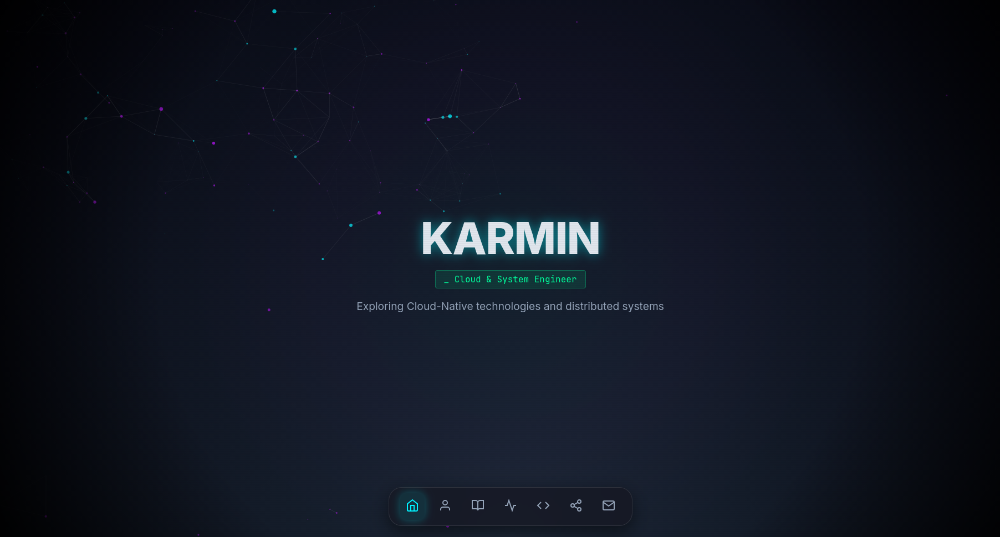
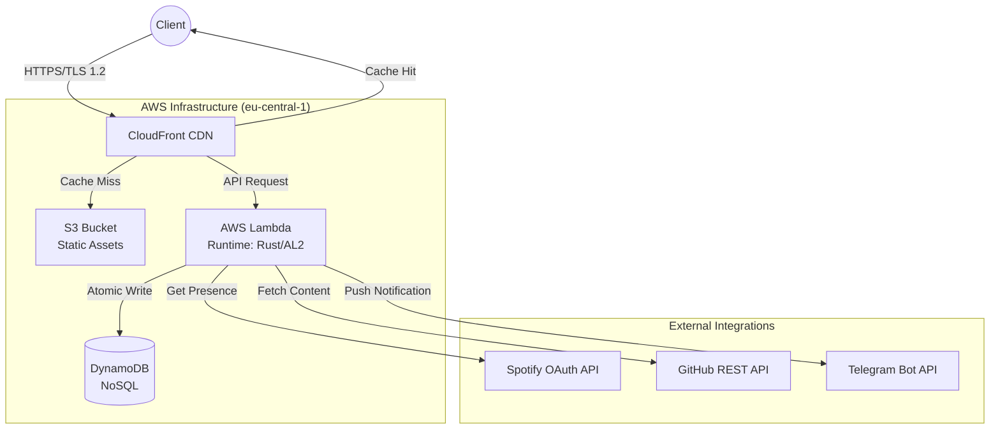

# **Serverless Cloud Platform (karmin.dev)**

This repository contains the infrastructure configuration and source code for **karmin.dev**, a high-performance serverless platform engineered to demonstrate Cloud Native principles, Infrastructure as Code (IaC), and Systems Programming.  
**Live System:** [https://karmin.dev](https://www.google.com/search?q=https://karmin.dev)
 

  

 

## **Project Overview**

The objective of this project was to architect a secure, scalable, and cost-efficient web platform without relying on traditional server provisioning (EC2/VMs). The architecture adheres to the AWS Well-Architected Framework, focusing on operational excellence, security, and performance efficiency.  
It serves as a production-grade portfolio featuring real-time data integration, atomic state management, and a custom headless content management system.

## **System Architecture**

The system utilizes a pure serverless approach. Static assets are delivered via Edge Locations (CDN), while dynamic logic is handled by a single compiled binary running on ephemeral compute resources.  

## **Technical Stack**

| Domain | Technology | Details |
| :---- | :---- | :---- |
| **Backend** | **Rust** | Axum Framework, Tokio Runtime, Reqwest. Compiled for Amazon Linux 2 (ARM64). |
| **Infrastructure** | **Terraform** | Full IaC coverage. Remote state management via S3 locking. |
| **Cloud Provider** | **AWS** | Lambda, API Gateway, DynamoDB, S3, CloudFront, Route53, IAM, ACM. |
| **CI/CD** | **GitHub Actions** | Automated testing, Rust cross-compilation, and atomic deployments. |
| **Frontend** | **Vanilla JS** | ES6+, Three.js for visualization, dependency-free architecture. |
| **CMS** | **Headless** | Custom implementation using GitHub Issues as a datastore. |

## **Key Engineering Features**

### **1\. High-Performance Backend (Rust)**

Instead of interpreted languages like Python or Node.js, the backend is written in **Rust** to maximize efficiency.

* **Memory Safety:** Utilizes Rust's ownership model to ensure memory safety in a serverless environment.  
* **Cold Starts:** Optimized to \<50ms using the AWS Lambda Custom Runtime.  
* **Binary Size:** Minimized binary footprint reduces network latency during container initialization.

### **2\. Infrastructure as Code (Terraform)**

The entire cloud environment is reproducible. No resources are provisioned manually via the AWS Console.

* **State Management:** Terraform state is stored in a remote, encrypted S3 bucket to ensure consistency and locking.  
* **Zero-Trust Security:** IAM roles are scoped to the principle of least privilege (e.g., Lambda can only write to specific DynamoDB tables).

### **3\. Automated CI/CD Pipeline**

Deployments are fully automated via GitHub Actions workflows:

* **Build:** Cross-compilation of Rust code for Linux ARM64 architecture using Zig.  
* **Deploy:** Terraform applies infrastructure changes automatically on push.  
* **Sync:** Static assets are synchronized to S3 with deletion of stale files.  
* **Cache Invalidation:** CloudFront cache is invalidated automatically post-deployment to ensure immediate content consistency.

### **4\. Custom Headless CMS**

To avoid database overhead for blog content, the system implements a "Lazy CMS" architecture:

* Articles are authored as **GitHub Issues** in a private repository using Markdown.  
* The Rust backend fetches, filters via labels, and caches these issues via the GitHub API.  
* Markdown is parsed client-side, allowing for a zero-cost, secure, and maintenance-free blogging platform.

## **API Endpoints**

The backend exposes a RESTful API routed via Axum:

* POST /api/visitors: Atomic increment of the visitor counter in DynamoDB.  
* GET /api/spotify: Retrieves real-time listening status via OAuth Refresh Token flow.  
* GET /api/github: Fetches recent commit activity and repository events.  
* GET /api/blog: Retrieves published articles from the issue tracker.  
* POST /api/contact: Formats and forwards user messages to a Telegram Bot via HTTPS.

## **Local Development**

### **Prerequisites**

* Rust (cargo, rustup)  
* Terraform v1.5+  
* AWS CLI (configured)  
* Zig (required for cross-compilation)

### **Deployment Instructions**

1. **Clone the repository:**  
   git clone https://github.com/karmiin/cloud-resume.git 
   cd cloud-resume

2. Infrastructure Setup:  
   Ensure you have a terraform.tfvars file with the required secrets (Spotify tokens, Telegram ID, etc.).  
   terraform init  
   terraform apply

3. **Backend Build:**  
   cd backend  
   cargo lambda build \--release \--output-format zip

## **License**

This project is open-source and available under the MIT License.
